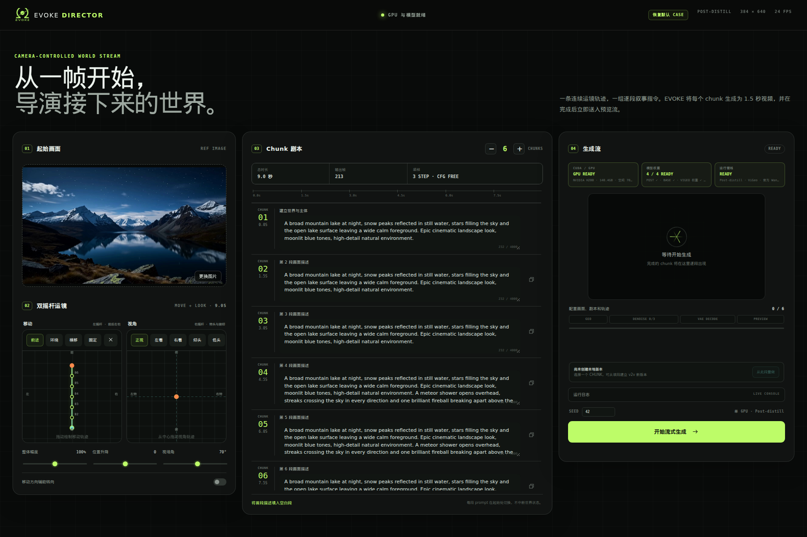

# EVOKE Director UI

`ui/` is the local web interface for the released post-distill model. It prepares the same
`image + pose.npz + prompt schedule + cases.jsonl` inputs used by EVOKE's launchers and calls
`scripts/inference/infer_post_distill.sh`. Persistent-worker and progress support live in the
repository's released inference launcher and pipeline; the UI does not duplicate model weights,
training code, or an inference implementation.

## Interface

<p align="center">
  
</p>

## What it supports

- One reference image as the global visual anchor.
- 1–40 chunks; one chunk is exactly 1.5 seconds at 24 fps.
- A required prompt for every chunk, emitted as EVOKE's native `start_chunk` schedule.
- Two simple, game-style camera pads: movement controls forward/back/strafe translation, while look
  independently controls yaw and pitch. Presets cover common moves and view directions.
- Exact trajectory coverage: the path is resampled to `chunks × 1.5 s × 30 fps`, with pixel-space
  1280×720 intrinsics and `cam_c2w` matrices in the NPZ format expected by the existing loader.
- Per-chunk MP4 preview as soon as `segment_NNN_pred.mp4` is written. FULL preview streams those
  chunks as a playlist; the canonical video is assembled only when download or continuation needs it.
- Director branching: select a completed chunk and regenerate that chunk plus its suffix. Chunks before
  the selection are retained, while a bounded parent-video + synchronized pose window conditions v2v.
- A single-GPU queue, a pipeline preloaded when the UI starts and kept resident between jobs, live
  logs, job cancellation, and persistent Project/Revision history across UI restarts.
- ViGeo weights and a CUDA dry run are also completed before the service reports Ready, so the first
  chunk contains only case-specific geometry work rather than a 4.8 GB lazy model load.
- A bundled six-chunk Meteor case is loaded by default and can be restored at any time from the UI.

## Prerequisites

Run the UI from a complete EVOKE checkout, not by copying this directory alone. First follow the
Environment and Weights sections in the [repository README](../README.md). In particular, the UI
requires:

- Python 3.10 and the same CUDA/PyTorch environment as EVOKE inference.
- `models/evoke-base`, `models/evoke/stage3_post_distillation`, and
  `models/ViGeo1.1/vigeo.pt`.
- The `ffmpeg` executable on `PATH` for browser previews and full-video downloads.

Verify the system dependency and install the small web layer:

```bash
cd Evoke
ffmpeg -version
python -m pip install -r ui/requirements.txt
```

## Run

Start the server from the repository root:

```bash
cd Evoke
python ui/app.py
```

Open <http://127.0.0.1:7860>. The first start preloads the post-distill pipeline and ViGeo before
the status changes to `READY`; this can take several minutes.

The default bind is local-only. The application has no built-in authentication or rate limiting.
Do not expose it directly to the public internet. If a trusted environment already supplies an
authenticated reverse proxy, bind explicitly:

```bash
EVOKE_UI_HOST=0.0.0.0 EVOKE_UI_PORT=7860 python ui/app.py
```

If the EVOKE inference interpreter is not the first Python on `PATH`, point the launcher at its bin
directory:

```bash
EVOKE_UI_PYTHON_BIN=/path/to/evoke-env/bin python ui/app.py
```

## Model paths

Model locations are configured in `ui/config.json`. Relative paths are resolved from the repository
root, not from `ui/`:

```json
{
  "models": {
    "base": "models/evoke-base",
    "transformer": "models/evoke/stage3_post_distillation",
    "vigeo": "models/ViGeo1.1",
    "da3": "models/DA3"
  }
}
```

Absolute paths are also accepted. Existing launcher environment variables take precedence over the
JSON values: `BASE_CKPT`, `TRANSFORMER_PATH`, `VIGEO_WEIGHTS` (or `EVOKE_VIGEO_WEIGHTS`), and
`DA3_WEIGHTS` (or `EVOKE_DA3_WEIGHTS`). The UI passes the resolved paths to both the persistent worker
and individual job launchers, so readiness checks and inference use the same files.

## Generated files

New work is stored as a non-destructive project/revision tree under `ui/projects/` (gitignored):

```text
ui/projects/<project-id>/
├── project.json
├── assets/
│   ├── reference.jpg
│   ├── trajectory_30fps.npz       # canonical i2v authoring track
│   └── trajectory_24fps.npz       # video-clock track used by v2v
└── revisions/r0001/
    ├── manifest.json
    ├── input/prompt_schedule.json
    ├── case.jsonl
    ├── spec.json
    └── output/evoke_ui/
        ├── segments/segment_NNN_pred.mp4
        ├── browser/                    # derived H.264 UI playback cache
        └── geo_pred.mp4
```

Each retry creates `r0002`, `r0003`, and so on; it never overwrites its parent. Legacy `ui/jobs/`
results remain readable and are imported into this layout when first used as a branch parent. Set
`EVOKE_UI_PROJECTS=/another/path` to relocate normalized projects; `EVOKE_UI_JOBS` controls the
persistent worker queue and legacy jobs. Files under `browser/` are derived previews; canonical
segments remain untouched for branching and can recreate the cache at any time.

The release allowlist in `ui/.gitignore` includes only the files required to run the application.
Generated jobs, projects, videos, logs, Python caches, local environments, downloaded weights, and
ad-hoc files remain local. Use Git (or an archive built from Git-tracked files) when preparing a
source release; do not archive a previously executed working directory verbatim.

## Notes

- The UI calls the released `models/evoke/stage3_post_distillation` checkpoint through the original
  launcher. `models/evoke-base` and `models/ViGeo1.1/vigeo.pt` are also required.
- Jobs are serialized through one persistent GPU worker because the post-distill pipeline is large.
  Startup changes from `LOADING` to `READY` after the base, transformer, text encoder, and VAE have
  loaded; later jobs reuse those resident weights. ViGeo and the Frame Bank remain rollout-local so
  state never leaks between jobs. Cancelling an active CUDA job restarts and preloads the worker.
- The optional LightTAE decoder adapter is adapted from
  [ModelTC/LightX2V](https://github.com/ModelTC/LightX2V) under Apache-2.0; the official Wan VAE remains
  the default decoder when no compatible LightTAE weights are configured.
- The movement pad is a top-down director-friendly abstraction rather than a SLAM solver: horizontal
  motion maps to camera X and vertical motion maps to camera Z. The look pad maps horizontal motion
  to yaw and vertical motion to pitch. "Overall amplitude" uses the historical value 24 as 100% and
  scales movement, positional lift, yaw, and pitch together. Positional lift changes camera height;
  look-pad pitch only rotates the view. Both paths share the chunk timeline. Optional movement-direction
  assistance adds the movement tangent to yaw; old specs without a look path keep their original
  path-following behavior.
